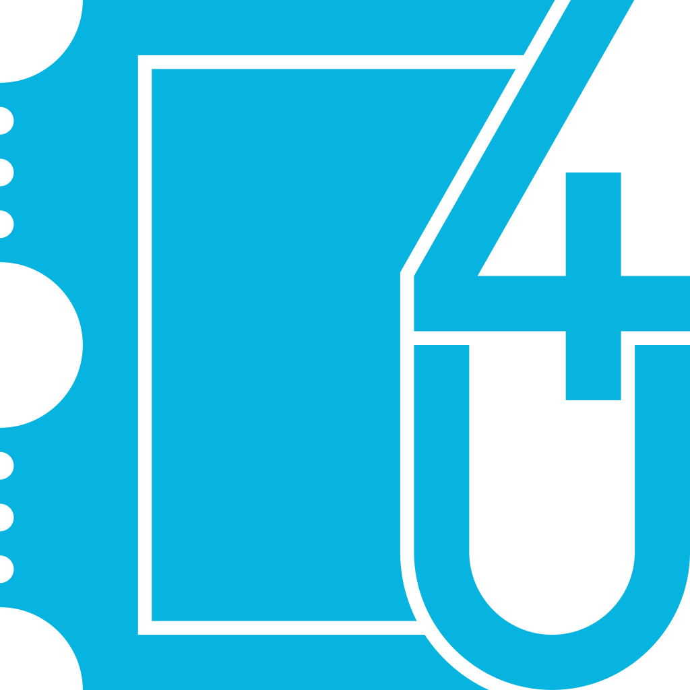

<!-- HEADER STYLE: CLASSIC -->

# <code>Ticket4U</code>

<em></em>

<!-- BADGES -->
<!-- local repository, no metadata badges. -->

<em>Built with the tools and technologies:</em>

 

 

 

---

## Overview

- Ticketing + ticket checking platform built with user-first mindset, optimizing for UX, performance, and scalability
- Built using microservices architecture, allows for horizontal scaling and distributed hosting
- Connect concert organizers to their customers, we aim at small, indie artists looking for a secure place to sell tickets
- Host purchases of tickets and slots fairly, with strict human verification process, avoiding scalpers, increasing customer trust

### Tech graph

---

## Features

|      | Component       | Details                              |
| :--- | :-------------- | :----------------------------------- |
| ⚙️  | **Architecture**  | <ul><li>Microservices architecture with a backend and frontend</li></ul> |
| 🔌 | **Integrations**  | <ul><li>Uses Spring Framework for backend services</li><li>Nuxt.js for frontend with i18n, pinia, and eslint integration</li><li>Uses bootstrap 5 for styling</li></ul> |
| 🧩 | **Modularity**    | <ul><li>Backend is modularized into different services (e.g., user-service)</li><li>Frontend components are built per-file, dynamically addressed to build the DOM</li></ul> |
| ⚡️  | **Performance**   | <ul><li>Uses Caffeine for caching, improves performance for querying JWTs, and Redis for distributed caching</li></ul> |
| 🛡️ | **Security**      | <ul><li>Includes security libraries like BouncyCastle and NimbusDS</li><li>Passwords are hashed with Argon2id, top choice for passwords</li><li>JWT tokens are signed using ES256, the better option would be EdDSA over ECDSA but tech stack lacks support</li></ul> |
| 📦 | **Dependencies**  | <ul><li>Manages dependencies using pnpm for frontend and Gradle for backend</li><li>Includes a variety of libraries such as Spring Framework, Nuxt.js, Pinia, and Bootstrap</li></ul> |
| 🚀 | **Scalability**   | <ul><li>Built on microservices architecture to allow horizontal scaling of individual services when demand rises</li><li>Containerized and can be orchestrated by k8s for auto scaling</li><li>Uses UUID v7 to allow distributed systems decoupling while remaining easy to index</li></ul> |

---

